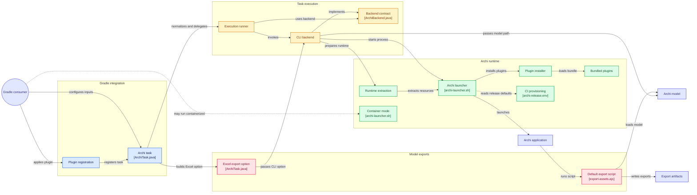

# Architecture Overview gradle-archi-plugin

```mermaid
flowchart LR

subgraph group_plugin["Gradle integration"]
  node_plugin["Plugin registration"]
  node_task["Archi task<br/>[ArchiTask.java]"]
end

subgraph group_execution["Task execution"]
  node_runner["Execution runner"]
  node_backend["CLI backend"]
  node_contract["Backend contract<br/>[ArchiBackend.java]"]
end

subgraph group_runtime["Archi runtime"]
  node_runtime_extract["Runtime extraction"]
  node_launcher["Archi launcher<br/>[archi-launcher.sh]"]
  node_plugin_installer["Plugin installer"]
  node_plugin_bundle["Bundled plugins"]
  node_provisioning["CI provisioning<br/>[archi-release.env]"]
  node_container_mode["Container mode<br/>[archi-launcher.sh]"]
end

subgraph group_exports["Model exports"]
  node_export_script["Default export script<br/>[export-assets.ajs]"]
  node_excel_export["Excel export option<br/>[ArchiTask.java]"]
end

node_consumer(("Gradle consumer"))
node_archi["Archi application"]
node_model["Archi model"]
node_artifacts["Export artifacts"]

node_consumer -->|"applies plugin"| node_plugin
node_plugin -->|"registers task"| node_task
node_consumer -->|"configures inputs"| node_task
node_task -->|"normalizes and delegates"| node_runner
node_runner -->|"uses backend"| node_contract
node_backend -->|"implements"| node_contract
node_runner -->|"invokes"| node_backend
node_backend -->|"prepares runtime"| node_runtime_extract
node_runtime_extract -->|"extracts resources"| node_launcher
node_backend -->|"starts process"| node_launcher
node_launcher -->|"installs plugins"| node_plugin_installer
node_plugin_installer -->|"loads bundle"| node_plugin_bundle
node_launcher -.->|"reads release defaults"| node_provisioning
node_launcher -->|"launches"| node_archi
node_archi -->|"runs script"| node_export_script
node_backend -->|"passes model path"| node_model
node_export_script -->|"loads model"| node_model
node_export_script -->|"writes exports"| node_artifacts
node_task -->|"builds Excel option"| node_excel_export
node_excel_export -->|"passes CLI option"| node_backend
node_consumer -.->|"may run containerized"| node_container_mode

click node_plugin "https://github.com/jurgenei/gradle-archi-plugin/blob/main/src/main/java/name/jurgenei/gradle/archi/ArchiGradlePlugin.java"
click node_task "https://github.com/jurgenei/gradle-archi-plugin/blob/main/src/main/java/name/jurgenei/gradle/archi/ArchiTask.java"
click node_runner "https://github.com/jurgenei/gradle-archi-plugin/blob/main/src/main/java/name/jurgenei/gradle/archi/ArchimateRunner.java"
click node_backend "https://github.com/jurgenei/gradle-archi-plugin/blob/main/src/main/java/name/jurgenei/gradle/archi/CliArchiBackend.java"
click node_contract "https://github.com/jurgenei/gradle-archi-plugin/blob/main/src/main/java/name/jurgenei/gradle/archi/ArchiBackend.java"
click node_runtime_extract "https://github.com/jurgenei/gradle-archi-plugin/blob/main/src/main/java/name/jurgenei/gradle/archi/CliArchiBackend.java"
click node_launcher "https://github.com/jurgenei/gradle-archi-plugin/blob/main/src/main/resources/archi/scripts/archi-launcher.sh"
click node_plugin_installer "https://github.com/jurgenei/gradle-archi-plugin/blob/main/src/main/resources/archi/bin/install-archiplugin.sh"
click node_plugin_bundle "https://github.com/jurgenei/gradle-archi-plugin/tree/main/src/main/resources/archi/plugins"
click node_provisioning "https://github.com/jurgenei/gradle-archi-plugin/blob/main/src/main/resources/archi/conf/archi-release.env"
click node_export_script "https://github.com/jurgenei/gradle-archi-plugin/blob/main/src/main/resources/archi/ajs/export-assets.ajs"
click node_excel_export "https://github.com/jurgenei/gradle-archi-plugin/blob/main/src/main/java/name/jurgenei/gradle/archi/ArchiTask.java"
click node_container_mode "https://github.com/jurgenei/gradle-archi-plugin/blob/main/src/main/resources/archi/scripts/archi-launcher.sh"

classDef toneNeutral fill:#f8fafc,stroke:#334155,stroke-width:1.5px,color:#0f172a
classDef toneBlue fill:#dbeafe,stroke:#2563eb,stroke-width:1.5px,color:#172554
classDef toneAmber fill:#fef3c7,stroke:#d97706,stroke-width:1.5px,color:#78350f
classDef toneMint fill:#dcfce7,stroke:#16a34a,stroke-width:1.5px,color:#14532d
classDef toneRose fill:#ffe4e6,stroke:#e11d48,stroke-width:1.5px,color:#881337
classDef toneIndigo fill:#e0e7ff,stroke:#4f46e5,stroke-width:1.5px,color:#312e81
classDef toneTeal fill:#ccfbf1,stroke:#0f766e,stroke-width:1.5px,color:#134e4a
class node_plugin,node_task toneBlue
class node_runner,node_backend,node_contract toneAmber
class node_runtime_extract,node_launcher,node_plugin_installer,node_plugin_bundle,node_provisioning,node_container_mode toneMint
class node_export_script,node_excel_export toneRose
class node_consumer,node_archi,node_model,node_artifacts toneIndigo
```
